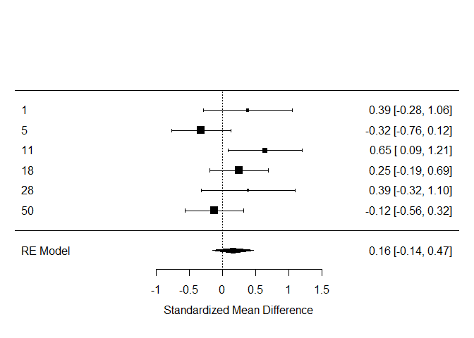
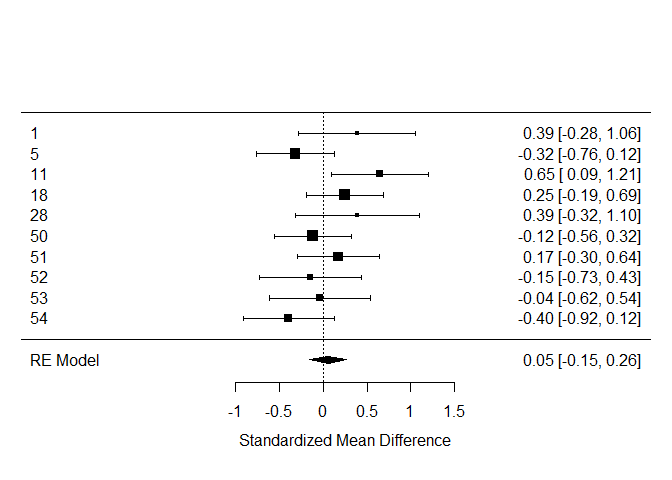
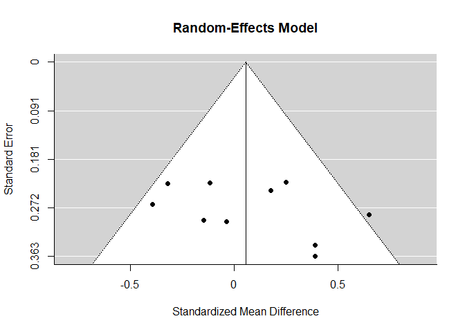
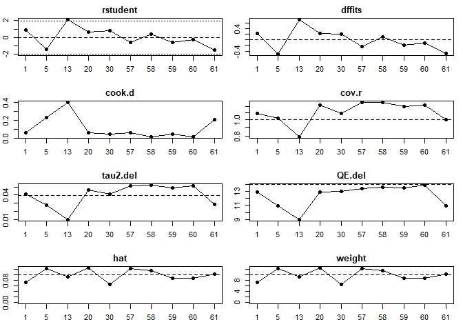

Building on the shoulders of giants: meta-analysis
==================================================

Questions to be answered
------------------------

1.  What is the current evidence for distinctive vocal patterns in
    schizophrenia? Report how many papers report quantitative estimates,
    comment on what percentage of the overall studies reviewed they
    represent (see PRISMA chart) your method to analyze them, the
    estimated effect size of the difference (mean effect size and
    standard error) and forest plots representing it. N.B. Only measures
    of pitch mean and pitch sd are required for the assignment. Feel
    free to ignore the rest (although pause behavior looks interesting,
    if you check my article).

2.  Do the results match your own analysis from Assignment 3? If you add
    your results to the meta-analysis, do the estimated effect sizes
    change? Report the new estimates and the new forest plots.

3.  Assess the quality of the literature: report and comment on
    heterogeneity of the studies (tau, I2), on publication bias (funnel
    plot), and on influential studies.

Packages etc

``` r
#Load packages
library(tidyverse, pacman)
```

    ## -- Attaching packages ------------------------------------------------------------ tidyverse 1.2.1 --

    ## v ggplot2 3.2.1     v purrr   0.3.2
    ## v tibble  2.1.3     v dplyr   0.8.3
    ## v tidyr   1.0.0     v stringr 1.4.0
    ## v readr   1.3.1     v forcats 0.4.0

    ## -- Conflicts --------------------------------------------------------------- tidyverse_conflicts() --
    ## x dplyr::filter() masks stats::filter()
    ## x dplyr::lag()    masks stats::lag()

``` r
pacman::p_load(metafor)
pacman::p_load(lme4)
pacman::p_load(lmerTest)
```

Tips on the process to follow:
------------------------------

-   Download the data on all published articles analyzing voice in
    schizophrenia and the prisma chart as reference of all articles
    found and reviewed

``` r
# We load the data
data <- read.delim("Matrix_MetaAnalysis_Diagnosis_updated290719.csv", sep =";")
```

d is the difference in standard deviations between the two groups.
(pooled standard deviation?) A standardized mean difference. Escalc from
metafor package similar to hedges g. We can use whatever?

-   Look through the dataset to find out which columns to use, and if
    there is any additional information written as comments (real world
    data is always messy!).
    -   Hint: PITCH\_F0M and PITCH\_F0SD group of variables are what you
        need
    -   Hint: Make sure you read the comments in the columns:
        `pitch_f0_variability`, `frequency`, `Title`,
        `ACOUST_ANA_DESCR`, `DESCRIPTION`, and `COMMENTS`

HC = Healthy control SZ = schitzophrenic M = mean (participant level)
And we also have for the group level SD = Standard deviation F0 = pith
–&gt; the dominant one. Pitch is the fundamental frequency. The
component of the vibrations with the biggest amplitude.

PITCH\_F0\_SZ\_M = mean –&gt; We also want to know across groups. –&gt;
PITCH\_F0SD\_SZ\_M –&gt; pitch variability

``` r
#we subset the data we need
data_2 <- select(data, StudyID, frequency, Title, SAMPLE_SIZE_SZ, SAMPLE_SIZE_HC, pitch_f0_variability, PITCH_F0SD_HC_M, PITCH_F0SD_HC_SD, PITCH_F0SD_SZ_SD, PITCH_F0SD_SZ_M, PITCH_F0_HC_M, PITCH_F0_HC_SD, PITCH_F0_SZ_SD, PITCH_F0_SZ_M, TYPE_OF_TASK)
```

-   Following the procedure in the slides calculate effect size and
    standard error of the effect size per each study. N.B. we focus on
    pitch mean and pitch standard deviation. . first try using lmer (to
    connect to what you know of mixed effects models) . then use rma()
    (to get some juicy additional statistics)

``` r
data_2 <- data_2[-c(58), ]

#We want to have the sum of sample size of each 
sample_size <- data_2 %>% filter(StudyID == 1 | StudyID == 5 |StudyID == 11 | StudyID == 18 | StudyID == 28 | StudyID == 50) %>% group_by(StudyID) %>% summarise(SAMPLE_SIZE_SZ, SAMPLE_SIZE_HC)  
sum(sample_size$SAMPLE_SIZE_SZ)
```

    ## [1] 249

``` r
sum(sample_size$SAMPLE_SIZE_HC)
```

    ## [1] 151

``` r
PitchMeanES <- metafor::escalc('SMD', #Standardized mean difference = Cohen's d
                               n1i = SAMPLE_SIZE_SZ, n2i = SAMPLE_SIZE_HC, 
                               m1i = PITCH_F0_SZ_M, m2i = PITCH_F0_HC_M, 
                               sd1i = PITCH_F0_SZ_SD, sd2i = PITCH_F0_HC_SD, data = data_2)

#vi is a measure of uncertainty (sd^2)
#y is the mean estimated cohen's d wihtin study 

#How do we include that different studies might look at different effects? Heterogeneity. 
model_ES <- lmer(yi ~ 1 + (1|StudyID), PitchMeanES, 
    # y is the outcome for i in nrow. We want the mean --> therefore 1 to get the intercept. 
     weights = 1/vi, REML=F, 
    #the weight is a positive weight. The bigger the variance, the smaller the decimal
     control = lmerControl( check.nobs.vs.nlev="ignore", 
                            check.nobs.vs.nRE="ignore"))
summary(model_ES)
```

    ## Linear mixed model fit by maximum likelihood . t-tests use
    ##   Satterthwaite's method [lmerModLmerTest]
    ## Formula: yi ~ 1 + (1 | StudyID)
    ##    Data: PitchMeanES
    ## Weights: 1/vi
    ## Control: 
    ## lmerControl(check.nobs.vs.nlev = "ignore", check.nobs.vs.nRE = "ignore")
    ## 
    ##      AIC      BIC   logLik deviance df.resid 
    ##      9.7      9.0     -1.8      3.7        3 
    ## 
    ## Scaled residuals: 
    ##       Min        1Q    Median        3Q       Max 
    ## -0.006661 -0.002930  0.001998  0.003651  0.007026 
    ## 
    ## Random effects:
    ##  Groups   Name        Variance  Std.Dev.
    ##  StudyID  (Intercept) 0.1078816 0.328453
    ##  Residual             0.0000362 0.006017
    ## Number of obs: 6, groups:  StudyID, 6
    ## 
    ## Fixed effects:
    ##             Estimate Std. Error     df t value Pr(>|t|)
    ## (Intercept)   0.2065     0.1341 6.0000    1.54    0.175

``` r
#A column is called task. We should add 1+Task(1+Task|Study)
#how does the second task differ from the first? How does the third task differ from the first? A difference of effect size. The difference in the difference between control and sz when looking at second in relation the first. Not concerned about the overall effect size

#0 + Task +(0 + Task|Study) --> for this there will be different intercepts. The estimate by condition. Not the estimate of the difference. 

model_ES1 <- lmer(yi ~ 1 + TYPE_OF_TASK + (1 + TYPE_OF_TASK|StudyID), PitchMeanES, 
    # y is the outcome for i in nrow. We want the mean --> therefore 1 to get the intercept. 
     weights = 1/vi, REML=F, 
    #the weight is a positive weight. The bigger the variance, the smaller the decimal
     control = lmerControl( check.nobs.vs.nlev="ignore", 
                            check.nobs.vs.nRE="ignore"))
```

    ## boundary (singular) fit: see ?isSingular

``` r
summary(model_ES1)
```

    ## Linear mixed model fit by maximum likelihood . t-tests use
    ##   Satterthwaite's method [lmerModLmerTest]
    ## Formula: yi ~ 1 + TYPE_OF_TASK + (1 + TYPE_OF_TASK | StudyID)
    ##    Data: PitchMeanES
    ## Weights: 1/vi
    ## Control: 
    ## lmerControl(check.nobs.vs.nlev = "ignore", check.nobs.vs.nRE = "ignore")
    ## 
    ##      AIC      BIC   logLik deviance df.resid 
    ##     -7.8     -9.9     13.9    -27.8       -4 
    ## 
    ## Scaled residuals: 
    ##        Min         1Q     Median         3Q        Max 
    ## -0.0010779  0.0000000  0.0001509  0.0003212  0.0008439 
    ## 
    ## Random effects:
    ##  Groups   Name               Variance  Std.Dev.  Corr       
    ##  StudyID  (Intercept)        8.670e-02 0.2944414            
    ##           TYPE_OF_TASKFREE   8.670e-02 0.2944414 -1.00      
    ##           TYPE_OF_TASKSOCIAL 8.670e-02 0.2944414 -1.00  1.00
    ##  Residual                    4.765e-07 0.0006903            
    ## Number of obs: 6, groups:  StudyID, 6
    ## 
    ## Fixed effects:
    ##                    Estimate Std. Error       df t value Pr(>|t|)  
    ## (Intercept)         0.27677    0.14722  5.99769   1.880   0.1092  
    ## TYPE_OF_TASKFREE   -0.02658    0.14722  5.99769  -0.181   0.8627  
    ## TYPE_OF_TASKSOCIAL -0.39503    0.14722  5.99769  -2.683   0.0364 *
    ## ---
    ## Signif. codes:  0 '***' 0.001 '**' 0.01 '*' 0.05 '.' 0.1 ' ' 1
    ## 
    ## Correlation of Fixed Effects:
    ##               (Intr) TYPE_OF_TASKF
    ## TYPE_OF_TASKF -1.000              
    ## TYPE_OF_TASKS -1.000  1.000       
    ## convergence code: 0
    ## boundary (singular) fit: see ?isSingular

-   Build a forest plot of the results (forest(model))

``` r
### We want to make a forest model ####
#We need to make to model into this format
Model <- rma(yi, vi, data = PitchMeanES, mods = ~ TYPE_OF_TASK, slab=StudyID) #rma and lmer is the same
```

    ## Warning in rma(yi, vi, data = PitchMeanES, mods = ~TYPE_OF_TASK, slab =
    ## StudyID): Studies with NAs omitted from model fitting.

    ## Warning in rma(yi, vi, data = PitchMeanES, mods = ~TYPE_OF_TASK, slab =
    ## StudyID): Redundant predictors dropped from the model.

``` r
Model
```

    ## 
    ## Mixed-Effects Model (k = 6; tau^2 estimator: REML)
    ## 
    ## tau^2 (estimated amount of residual heterogeneity):     0.1362 (SE = 0.1854)
    ## tau (square root of estimated tau^2 value):             0.3691
    ## I^2 (residual heterogeneity / unaccounted variability): 60.81%
    ## H^2 (unaccounted variability / sampling variability):   2.55
    ## R^2 (amount of heterogeneity accounted for):            0.00%
    ## 
    ## Test for Residual Heterogeneity:
    ## QE(df = 3) = 8.2816, p-val = 0.0405
    ## 
    ## Test of Moderators (coefficients 2:3):
    ## QM(df = 2) = 0.5702, p-val = 0.7519
    ## 
    ## Model Results:
    ## 
    ##                     estimate      se     zval    pval    ci.lb   ci.ub 
    ## intrcpt              -0.1183  0.4326  -0.2734  0.7846  -0.9662  0.7297    
    ## TYPE_OF_TASKCONSTR    0.3608  0.4939   0.7305  0.4651  -0.6072  1.3288    
    ## TYPE_OF_TASKFREE      0.3684  0.6110   0.6030  0.5465  -0.8292  1.5661    
    ## 
    ## ---
    ## Signif. codes:  0 '***' 0.001 '**' 0.01 '*' 0.05 '.' 0.1 ' ' 1

``` r
## Since the moderator with tyoes of task wasn't significant we will do the model without it
Model <- rma(yi, vi, data = PitchMeanES, slab=StudyID)
```

    ## Warning in rma(yi, vi, data = PitchMeanES, slab = StudyID): Studies with
    ## NAs omitted from model fitting.

``` r
Model
```

    ## 
    ## Random-Effects Model (k = 6; tau^2 estimator: REML)
    ## 
    ## tau^2 (estimated amount of total heterogeneity): 0.0712 (SE = 0.0908)
    ## tau (square root of estimated tau^2 value):      0.2668
    ## I^2 (total heterogeneity / total variability):   50.29%
    ## H^2 (total variability / sampling variability):  2.01
    ## 
    ## Test for Heterogeneity:
    ## Q(df = 5) = 9.8471, p-val = 0.0797
    ## 
    ## Model Results:
    ## 
    ## estimate      se    zval    pval    ci.lb   ci.ub 
    ##   0.1627  0.1554  1.0476  0.2948  -0.1417  0.4672    
    ## 
    ## ---
    ## Signif. codes:  0 '***' 0.001 '**' 0.01 '*' 0.05 '.' 0.1 ' ' 1

``` r
#Then we plot
forest(Model)
```



-   Go back to Assignment 3, add your own study to the data table, and
    re-run meta-analysis. Do the results change?

``` r
#We will load our data from Assignment 3
assignment_data <- read.csv("C:/Users/katri/OneDrive/Dokumenter/Cognitive Science/Experimental_Methods_III/Assignment_3/df_2.csv")

#We need to have unique study IDs as a column in the new summed up df
ass_3 <- data.frame(StudyID = c(51, 52, 53, 54))
#We need to have sample size in a dataframe
ass_3$SAMPLE_SIZE_SZ <- c(34, 23, 19, 29)
ass_3$SAMPLE_SIZE_HC <- c(36, 23, 28, 29)

#The mean and standard deviations of each studies
df2_healthy<-subset(assignment_data,diagnosis==0)
df2_schiz<-subset(assignment_data,diagnosis==1)

#We want mean of the frequency and standard deviation of the mean
d_H<-df2_healthy %>% group_by(study) %>% dplyr::summarize(Mean= mean(mean_frequency), sd = sd(mean_frequency), Mean_sd = mean(sd_frequency), sd_sd = sd(sd_frequency))

d_S<-df2_schiz %>% group_by(study) %>% dplyr::summarize(Mean = mean(mean_frequency), sd = sd(mean_frequency), Mean_sd = mean(sd_frequency), sd_sd = sd(sd_frequency))

### Mean and standard deviations of the mean_frequency
ass_3$PITCH_F0_HC_M <-d_H$Mean
ass_3$PITCH_F0_SZ_M <-d_S$Mean

ass_3$PITCH_F0_HC_SD <- d_H$sd

ass_3$PITCH_F0_SZ_SD <- d_S$sd

#### Mean and standard deviations of all standard deviations

#Mean of the sd_frequencies for HC
ass_3$PITCH_F0SD_HC_M <- d_H$Mean_sd
#sd of the sd_frequencies for HC
ass_3$PITCH_F0SD_HC_SD <- d_H$sd_sd
#sd of the sd_frequencies for SZ
ass_3$PITCH_F0SD_SZ_SD <- d_S$sd_sd
#Mean of the sd_frequencies for SZ
ass_3$PITCH_F0SD_SZ_M <- d_S$Mean_sd

## We ad this to the our data from before
dd <- merge(data_2, ass_3, all = TRUE)
```

We want to compare this with our results now
--------------------------------------------

``` r
#We calculate Cohen's d
PitchMeanES <- metafor::escalc('SMD', #Standardized mean difference = Cohen's d
                               n1i = SAMPLE_SIZE_SZ, n2i = SAMPLE_SIZE_HC, 
                               m1i = PITCH_F0_SZ_M, m2i = PITCH_F0_HC_M, 
                               sd1i = PITCH_F0_SZ_SD, sd2i = PITCH_F0_HC_SD, data = ass_3)

#vi is a measure of uncertainty (sd^2)
#y is the mean estimated cohen's d wihtin study 

#How do we include that different studies might look at different effects? Heterogeneity. 
model_ass_3 <- rma(yi, vi, data = PitchMeanES, slab=StudyID)
model_ass_3
```

    ## 
    ## Random-Effects Model (k = 4; tau^2 estimator: REML)
    ## 
    ## tau^2 (estimated amount of total heterogeneity): 0.0006 (SE = 0.0606)
    ## tau (square root of estimated tau^2 value):      0.0253
    ## I^2 (total heterogeneity / total variability):   0.85%
    ## H^2 (total variability / sampling variability):  1.01
    ## 
    ## Test for Heterogeneity:
    ## Q(df = 3) = 2.6167, p-val = 0.4546
    ## 
    ## Model Results:
    ## 
    ## estimate      se     zval    pval    ci.lb   ci.ub 
    ##  -0.0867  0.1362  -0.6370  0.5241  -0.3536  0.1801    
    ## 
    ## ---
    ## Signif. codes:  0 '***' 0.001 '**' 0.01 '*' 0.05 '.' 0.1 ' ' 1

We will rerun analysis now with Assignment 3

``` r
# We calculate Cohen's D
dd <- metafor::escalc('SMD', #Standardized mean difference = Cohen's d
                               n1i = SAMPLE_SIZE_SZ, n2i = SAMPLE_SIZE_HC, 
                               m1i = PITCH_F0_SZ_M, m2i = PITCH_F0_HC_M, 
                               sd1i = PITCH_F0_SZ_SD, sd2i = PITCH_F0_HC_SD, data = dd)

#We need to make to model into this format
Model_dd <- rma(yi, vi, data = dd, slab=StudyID) #rma and lmer is the same
```

    ## Warning in rma(yi, vi, data = dd, slab = StudyID): Studies with NAs omitted
    ## from model fitting.

``` r
Model_dd
```

    ## 
    ## Random-Effects Model (k = 10; tau^2 estimator: REML)
    ## 
    ## tau^2 (estimated amount of total heterogeneity): 0.0394 (SE = 0.0522)
    ## tau (square root of estimated tau^2 value):      0.1986
    ## I^2 (total heterogeneity / total variability):   35.66%
    ## H^2 (total variability / sampling variability):  1.55
    ## 
    ## Test for Heterogeneity:
    ## Q(df = 9) = 13.9374, p-val = 0.1246
    ## 
    ## Model Results:
    ## 
    ## estimate      se    zval    pval    ci.lb   ci.ub 
    ##   0.0546  0.1060  0.5152  0.6064  -0.1532  0.2624    
    ## 
    ## ---
    ## Signif. codes:  0 '***' 0.001 '**' 0.01 '*' 0.05 '.' 0.1 ' ' 1

``` r
#Then we plot
forest(Model_dd)
```



-   We make a funnel plot to look at publication biases

``` r
#We also want to make a funnel plot which plots effect size against standard error
funnel(Model_dd, main = "Random-Effects Model", xlab = "Standardized Mean Difference")
```


\#\# We test for influential studies

``` r
inf <- influence(Model_dd)
print(inf)
```

    ## 
    ##    rstudent  dffits cook.d  cov.r tau2.del  QE.del    hat  weight    dfbs 
    ## 1    0.8712  0.2411 0.0586 1.0919   0.0408 12.8496 0.0721  7.2064  0.2406 
    ## 5   -1.4176 -0.5175 0.2323 1.0161   0.0274 10.9725 0.1237 12.3683 -0.5116 
    ## 11   2.1006  0.7322 0.4025 0.7880   0.0094  8.9617 0.0933  9.3340  0.7489 
    ## 18   0.6674  0.2365 0.0605 1.2177   0.0466 12.9343 0.1257 12.5709  0.2381 
    ## 28   0.8341  0.2190 0.0485 1.0896   0.0413 12.9678 0.0657  6.5705  0.2183 
    ## 50  -0.5848 -0.2362 0.0630 1.2630   0.0512 13.3476 0.1243 12.4335 -0.2384 
    ## 51   0.3775  0.1134 0.0145 1.2619   0.0521 13.5918 0.1161 11.6055  0.1141 
    ## 52  -0.5795 -0.1998 0.0428 1.1932   0.0487 13.4868 0.0888  8.8758 -0.1986 
    ## 53  -0.2669 -0.1054 0.0122 1.2213   0.0516 13.8567 0.0879  8.7946 -0.1046 
    ## 54  -1.5068 -0.4812 0.2075 0.9953   0.0280 10.8992 0.1024 10.2405 -0.4819 
    ##    inf 
    ## 1 
    ## 5 
    ## 11 
    ## 18 
    ## 28 
    ## 50 
    ## 51 
    ## 52 
    ## 53 
    ## 54

``` r
summary(inf)
```

    ##         Length Class    Mode   
    ## inf     11     list.rma list   
    ## dfbs     3     list.rma list   
    ## ids     10     -none-   numeric
    ## not.na  10     -none-   logical
    ## is.infl 10     -none-   logical
    ## tau2     1     -none-   numeric
    ## QE       1     -none-   numeric
    ## k        1     -none-   numeric
    ## p        1     -none-   numeric
    ## m        1     -none-   numeric
    ## digits   9     -none-   numeric

``` r
plot(inf)
```


Link to the report:
<a href="https://docs.google.com/document/d/1bqmqCdRxM9cL7cjE-gZww4wpaeBAZcWJndLYK3LvHdA/edit?usp=sharing" class="uri">https://docs.google.com/document/d/1bqmqCdRxM9cL7cjE-gZww4wpaeBAZcWJndLYK3LvHdA/edit?usp=sharing</a>
